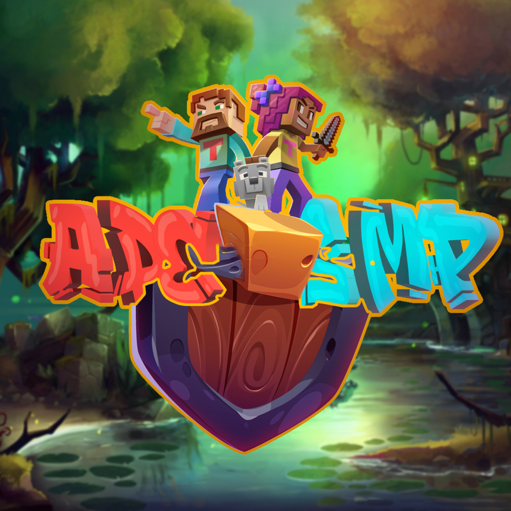

[](https://java.com/)

[](LICENSE)
[](https://discord.gg/bU7HreUJJH)

# ADE-SMP
ADE-SMP Is An Open Sourced Minecraft Cross Platfrom SMP Server.
It Is Mainly Maintained And Hosted By Ade Issawe aka (7Wdev/Ade216), I Decided To Make It Open Sourced So That It Can Be Controlled And Maintained By Community Out There.
They Might Provide Such Contributions As:
- Adding New Features
- Fixing Bugs
- Doing Security Patches
- Building Worlds,Lobbies And Maps
etc...

By Open Sourcing The Server We Enables The Opportunity To Maintain It Faster And In A Proffessional Way That Is Based On Creativity And Cooperation Of The Community!
Also It Makes The Server More Secure By Increasing The Rate Of Releasing Security Patches.
So Yea Read All The ReadME File And Have Fun Playing, Creating, And Innovating In ADE-SMP!


# ABOUT SERVER
**ADE-SMP Is An Open Sourced Minecraft Cross Platfrom SMP Server.**
It has many cool features such as Earth Map, Mods, Economy, Shop as well as some MiniGames and more...
The server is now officially open! (Welcome - Have Fun ♥)

- ip : play.ade-smp.tk:19132

- map website : play.ade-smp.tk:3000

- admin panel : Only Ade Issawe (Ade216/7Wdev) has the rights to use it.

- versions : 
```
1.19.2/1.19.3 java
1.19.21->1.19.60 bedrock
```

- Some Ingame Useful Commands :
```
/guidebook - gives a guide book that teaches you everything you need about the server
/help - to get all commands list
/warp (name) - tp to a warp
/setwarp (name) - to set a warp location
/warps - to see warps list
/money - to see your ballance and do other money related stuff
/sethome (name) - to set a home location
/home (name) - tp to your home
/market - gui shop
/market sell (price) - to sell the item in your hand
/market send (name) - to send items over mail
/bffa - join lavaice to join buildffa
/bffa - leave to leave buildffa
/vegas - menu to join casino
/trash - opens a trash
/pay - to give/pay someone moeny
/discord link - to link your minecraft account with discord 
/quickshop - to create a chest based shop
/buyclaimblocks - to buy land/claim blocks
/sellclaimblocks - to sell land/claim blocks
/unclaim - removes ownership over a land
/Placing a Sign on a chest Locks the chest
/You can select land by using a gold shovel
```

**NOTICE: BEFORE YOU JOIN ANY MINIGAME BE SURE THAT YOUR INVENTORY IS EMPTY**

**----------- Clients -----------**
- Android/Ios: ```Pojavlauncher, Minecraft Bedrock```
- PC/Mac: ```Tlaucher/Official Launcher/Minecraft Windows 10```
- Ps4/Ps5/Xbox: ```Minecraft Bedrock ```

||Discord : [](https://discord.gg/bU7HreUJJH)

Github: [ADE-SMP](https://github.com/7Wdev/ADE-SMP)||


## FEATURE REQUEST/BUG REPORT


## PR REQUESTS
The ADE-SMP project welcomes contributions from the community in the form of pull requests. If you are interested in making a contribution, please keep in mind the following guidelines:

- Pull requests should be focused on one specific issue or feature.
- Pull requests should be detailed and clearly explain the problem and solution, or if it was a new feature then explain how it is implemented.
- Pull requests should include tests, where applicable.
- Pull requests should be related to:
```
SECURITY PATCHES, NEW PLUGINS, NEW APIs, NEW TEXTURES, NEW DATAPACKS, PERFORMANCE OPTIMIZATION, UPDATING THE SERVER TO NEWER VERSION, MODIFYING APIs, IMPROVING PRE-ADDED APIs AND PLUGINS, ADDING MAPS/WORLDS/BUILDINGS, UPDATING PLUGINS, PANEL IMPROVEMENT, REDESIGN SERVER/PANEL/LOGO, or whatever kind of modification/deletion/addition.
```

To submit a pull request, please follow these steps:

Fork the ADE-SMP repository on Github.

Create a new branch for your changes.

Make your changes, and ensure that your code adheres to the project's coding style and standards.

Make sure that changes adheres to the to the project's file structure.

**NOTE:** if you use a public/free premade datapack, texture, plugin, api, map or whatever kind of resources, please consider to credit it in the ```cr.md```, and make sure that you have the rights! 

Commit your changes and push them to your fork.

Submit a pull request to the ADE-SMP repository.

I will review all pull requests and may request additional changes before merging.

I greatly appreciate the time and effort that developers, builders and designers put into the project, and I am grateful for their contributions. Please feel free to submit a pull request on Github to contribute to the project.


## FUNDING/DONATION
Adventure awaits in the world of ADE-SMP, but we need your help to keep the journey going.
As a community-driven open-source Minecraft server, we rely on the support of players and users like you to keep our server up and running.
From server costs to development resources, it takes a village to keep ADE-SMP going strong.

Imagine a world where every block is a building block for something great, where every step is a step towards an adventure. This is the world we have built together, and with your help, we can continue to build it.

We are humbly asking for your support to help us cover expenses such as server costs, development resources, and other expenses associated with running the project.

Keep in mind, we pride ourselves in being a fair and inclusive server, where everyone has access to the same resources and game experiences. Unlike other servers, we don't believe in locking content behind paywalls or in-game purchases or ranks. ADE-SMP is a server for the people, for the community and it's controlled by the community.

You can make a difference by donating via [](https://paypal.me/AdeIssawe).

Together, we can make ADE-SMP a world where imagination has no limits and adventure is always within reach. Thank you for your support!


## AKNOWLEDGEMETS 
I would like to express my deepest gratitude to the individuals and organizations who contributed and supported the ADE-SMP project.

First and foremost, I would like to thank the 7Wdev team for their tireless efforts in developing and maintaining this project. I would also like to thank the community of developers, who have contributed to the codebase, reported bugs, and provided valuable feedback. As well as the comunity of builders and textures designers for their effort.

I would like to thank all the users of ADE-SMP for their interest and support. The feedback from the community is always incredibly helpful in shaping the project.

I would also like to thank our mentors and advisors for their guidance and support throughout the development of ADE-SMP.

Finally, I would like to acknowledge all the open-source libraries, frameworks, free plugins, pre-built maps and textures  that were used in this project, which have made the development process much easier. I would like to give the credits for creators and developers who made them:

- Credits: [credits](https://github.com/7Wdev/ADE-SMP/cr.md)

Thank you all for your support and help.


## CONTRIBUTIONS
Any contributions are appreciated. Please feel free to reach out to us on [](https://discord.gg/bU7HreUJJH) if
you're interested in helping out with ADE-SMP.
